# RPG Explainer - Example Analyses

This document showcases the RPG Explainer tool analyzing various RPG programs. Each example shows the original source code followed by the tool's comprehensive analysis including Mermaid diagrams for visualization.

---

## Table of Contents

1. [File Sum Calculator (Fixed-Form)](#1-file-sum-calculator-sumrpgle) - Basic file I/O with subroutine
2. [Square Function (Free-Form)](#2-square-function-free_pow_2rpgle) - Modern free-form with subprocedure
3. [Date Format Handling (Fixed-Form)](#3-date-format-handling-date_formatsrpgle) - Date conversion demonstration
4. [Client CRUD Operations (Mixed-Form)](#4-client-crud-operations-clients_crudrpgle) - Full CRUD with validation

---

## 1. File Sum Calculator (`sum.rpgle`)

A fixed-format RPG program that reads records from a file and calculates a running sum.

### Source Code

```rpgle
     F* File definition
     FMYFILE    IF   E             DISK
     D* Variable declaration
     Dsum              s              4s 0 inz(0)
     Dstr              s             25a   inz('')
     C* Program start
     C                   EXSR      CALC
     C                   eval      *inlr = *on
     C     CALC          BEGSR
     C                   READ      MYFILE
     C     *IN90         DOWEQ     *OFF
     C                   eval      sum = sum + fld2
     C                   READ      MYFILE
     C                   ENDDO
     C                   eval      str = 'La suma es '
     C     str           DSPLY
     C     sum           DSPLY
     C                   ENDSR
```

### Analysis

# RPG Program Analysis Report: SUM.RPGLE

## 1. Executive Summary

This is a fixed-format ILE RPG program that reads records from a disk file (MYFILE) and calculates a running sum of a numeric field (`fld2`) from each record. The program iterates through all records in the file, accumulates the total, and displays both a descriptive message ("La suma es" - Spanish for "The sum is") and the calculated sum value to the user via the DSPLY operation.

## 2. Program Architecture

### Overall Structure

This is a simple, single-module RPG program using the traditional fixed-format specification style. The program follows a classic RPG pattern:

- **Main Cycle Entry**: Executes the CALC subroutine and then terminates
- **CALC Subroutine**: Contains all the business logic for reading and summing records

### Program Flow

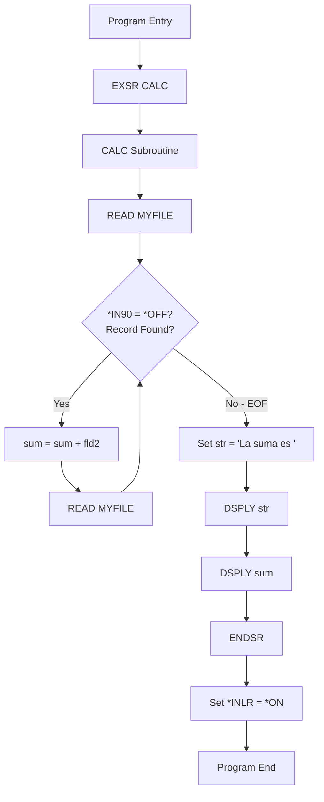

### Key Data Flows

1. **Input**: Records from MYFILE containing field `fld2`
2. **Processing**: Accumulation of `fld2` values into `sum`
3. **Output**: Display of message and sum total to workstation

## 3. File Dependencies

### MYFILE

| Attribute | Value |
|-----------|-------|
| **File Type** | Input (IF) |
| **Device** | DISK |
| **External Description** | Yes (E) |
| **Usage** | Read-only |
| **Accessed By** | CALC subroutine |

**Purpose Analysis**:
- MYFILE is an externally-described physical or logical file
- The program expects this file to contain at least one numeric field named `fld2`
- The file is opened for input only (no updates or writes)
- Indicator 90 (`*IN90`) is used as the end-of-file indicator for READ operations

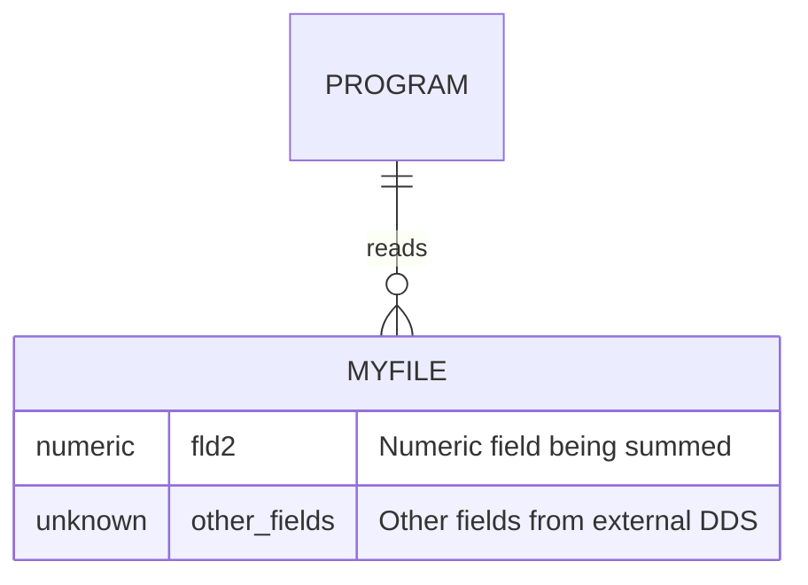

## 4. External Dependencies

### System Dependencies

| Dependency Type | Name | Purpose |
|-----------------|------|---------|
| **Database File** | MYFILE | Source data file (must exist on system) |
| **System Operation** | DSPLY | Display message to workstation user |

### Integration Points

- **No external program calls**: This program is self-contained
- **No API calls**: Uses only native RPG operations
- **No service programs**: Standalone *PGM object

## 5. Key Procedures

### Main Program Entry (Implicit)

| Aspect | Description |
|--------|-------------|
| **Purpose** | Program initialization and control flow |
| **Logic** | Calls CALC subroutine, then sets LR indicator to end program |
| **Parameters** | None |

### CALC Subroutine

| Aspect | Description |
|--------|-------------|
| **Purpose** | Read all records from MYFILE and sum the fld2 values |
| **Input** | Records from MYFILE |
| **Output** | Displays sum to user |
| **Indicators Used** | *IN90 (EOF indicator) |

**Internal Logic**:
1. Perform initial READ of MYFILE
2. Loop while records exist (*IN90 = *OFF)
3. Add `fld2` to running `sum`
4. Read next record
5. After loop, display results

## 6. Detailed Functionality Analysis

### Business Logic & Rules

#### Calculations Performed
- **Summation**: Accumulates all values of `fld2` from every record in MYFILE
- **Formula**: `sum = sum + fld2` (simple addition)

#### Validations & Constraints
- **None explicit**: The program does not validate data before processing
- **Implicit constraint**: `sum` is defined as 4 digits with 0 decimal places (`4s 0`), limiting the maximum sum to 9999
- **Overflow risk**: If the sum exceeds 9999, a runtime error will occur

### Processing Flow

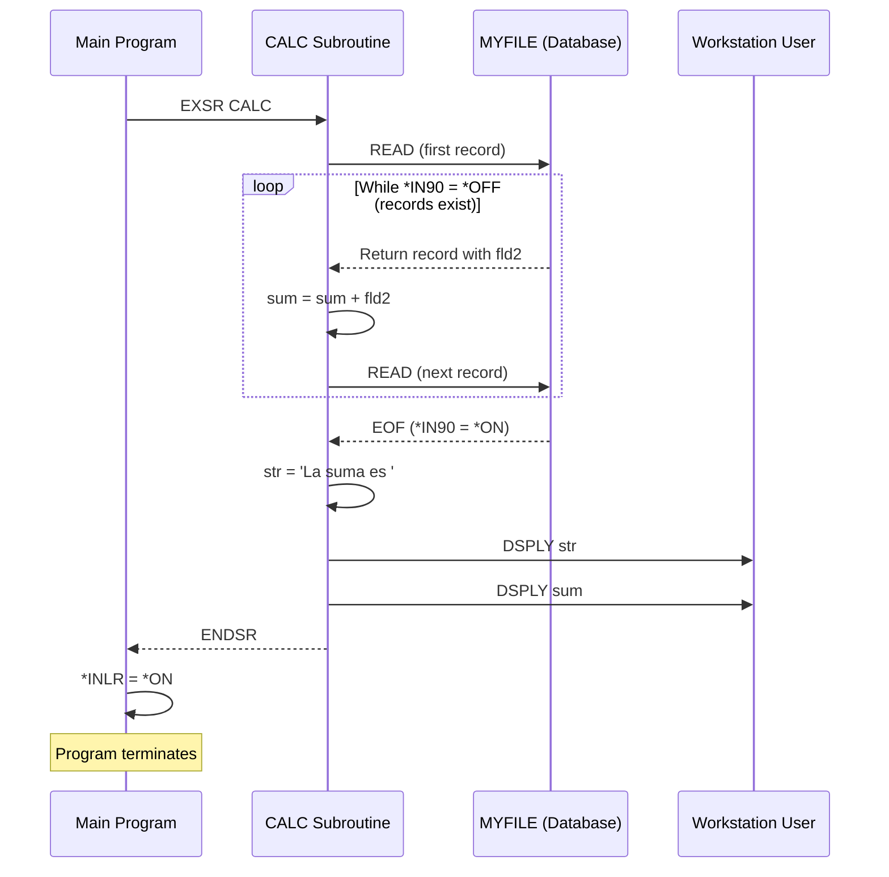

### Integration Points

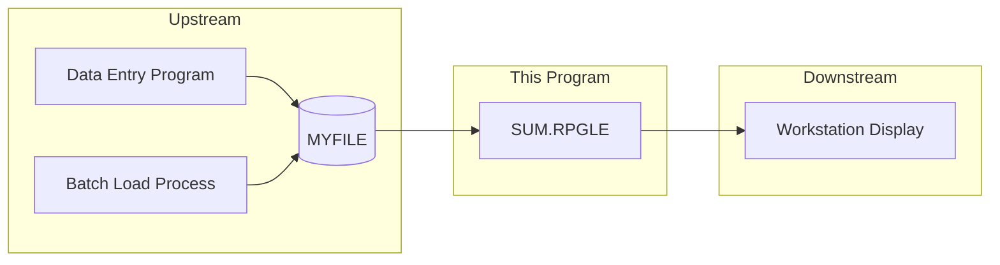

## 7. Recommendations

### Potential Modernization Opportunities

1. **Convert to Free-Format RPG**
2. **Increase sum capacity**: Change from `4s 0` to larger packed decimal to prevent overflow
3. **Add error handling**: Check for file open errors, handle potential numeric overflow
4. **Replace DSPLY**: Consider writing to a spool file or returning value to calling program

### Areas Requiring Closer Review

| Area | Concern | Priority |
|------|---------|----------|
| `sum` size (4,0) | Overflow risk if sum > 9999 | **High** |
| No error handling | Program will crash on file errors | **Medium** |
| Hardcoded file name | Limits reusability | **Low** |
| Spanish message | Consider externalization for i18n | **Low** |

---

## 2. Square Function (`free_pow_2.rpgle`)

A modern free-form RPG program demonstrating subprocedure creation and usage.

### Source Code

```rpgle
**free
CTL-OPT dftactgrp(*NO);
// Prototype for procedure Square. This is optional
DCL-PR square INT(10);
  num INT(5) VALUE;
END-PR;
// Main code
dsply square(5);
*inlr = *on;
// Square implementation
DCL-PROC square;
  DCL-PI *N INT(10);
    num INT(5) VALUE;
  END-PI;
  DCL-S Result INT(10);
  Result = num ** 2;
  return Result;
END-PROC;
```

### Analysis

# RPG Program Analysis Report: free_pow_2.rpgle

## 1. Executive Summary

This is a simple demonstration program that implements a mathematical square function using ILE RPG's free-form syntax and subprocedure capabilities. The program defines a reusable `square` procedure that takes an integer input and returns its squared value, then demonstrates its usage by displaying the result of squaring the number 5. This serves as an educational example of how to create and call subprocedures in modern RPG.

## 2. Program Architecture

### Overall Structure

The program follows a straightforward architecture with a main entry point and a single subprocedure:

- **Main Program**: Serves as the entry point, calls the `square` procedure with a test value, and terminates
- **Square Procedure**: A self-contained function that performs the mathematical squaring operation

### Component Relationships

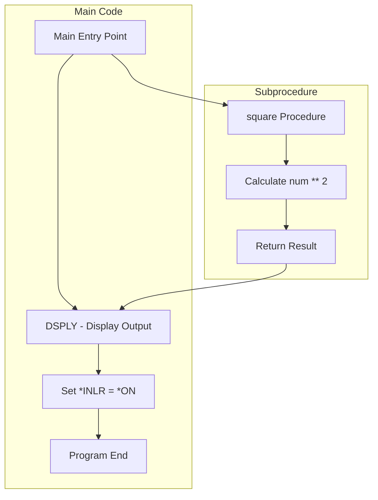

### Key Data Flows

1. **Input**: Literal value `5` passed to the `square` procedure
2. **Processing**: Value is squared using the exponentiation operator (`**`)
3. **Output**: Result is displayed to the user via `DSPLY` operation

## 3. File Dependencies

**No file dependencies exist in this program.**

This program operates entirely in memory without any database file interactions.

## 4. External Dependencies

### Control Options

```rpgle
CTL-OPT dftactgrp(*NO);
```

This control option specifies:
- **dftactgrp(*NO)**: The program will NOT run in the default activation group, which is required when using ILE procedures

### System Dependencies

| Dependency | Type | Purpose |
|------------|------|---------|
| DSPLY | Built-in Operation | Display message to user/job log |
| *INLR | Indicator | Last Record indicator for program termination |

## 5. Key Procedures

### Procedure: `square`

| Attribute | Value |
|-----------|-------|
| **Purpose** | Calculate the square of an integer |
| **Return Type** | INT(10) - 10-digit integer |
| **Scope** | Internal procedure |

#### Parameters

| Name | Type | Mode | Description |
|------|------|------|-------------|
| `num` | INT(5) | VALUE | Input number to be squared (passed by value) |

#### Internal Logic

```rpgle
DCL-S Result INT(10);
Result = num ** 2;
return Result;
```

## 6. Detailed Functionality Analysis

### Business Logic & Rules

#### Mathematical Rules
- **Squaring Operation**: The program implements the mathematical formula: `result = n²`

#### Constraints
| Constraint | Value | Reason |
|------------|-------|--------|
| Input Range | -32,768 to 32,767 | INT(5) data type limitation |
| Output Range | 0 to 2,147,483,647 | INT(10) data type limitation |
| Maximum Safe Input | ±46,340 | Larger values would overflow INT(10) |

### Data Entities & Structures

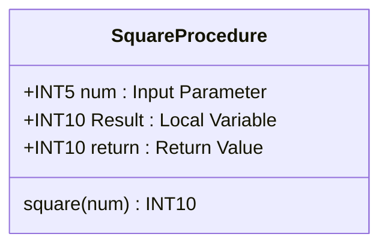

### Processing Flow

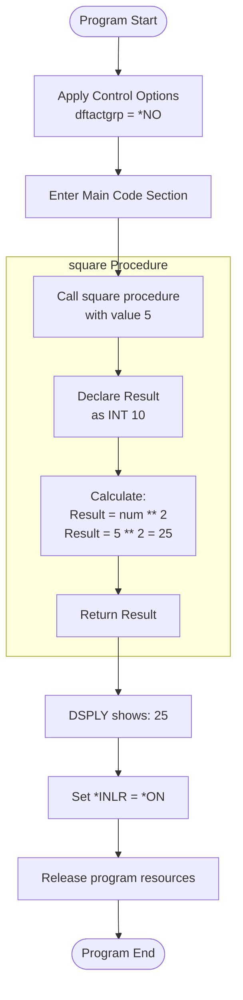

### Sequence Diagram

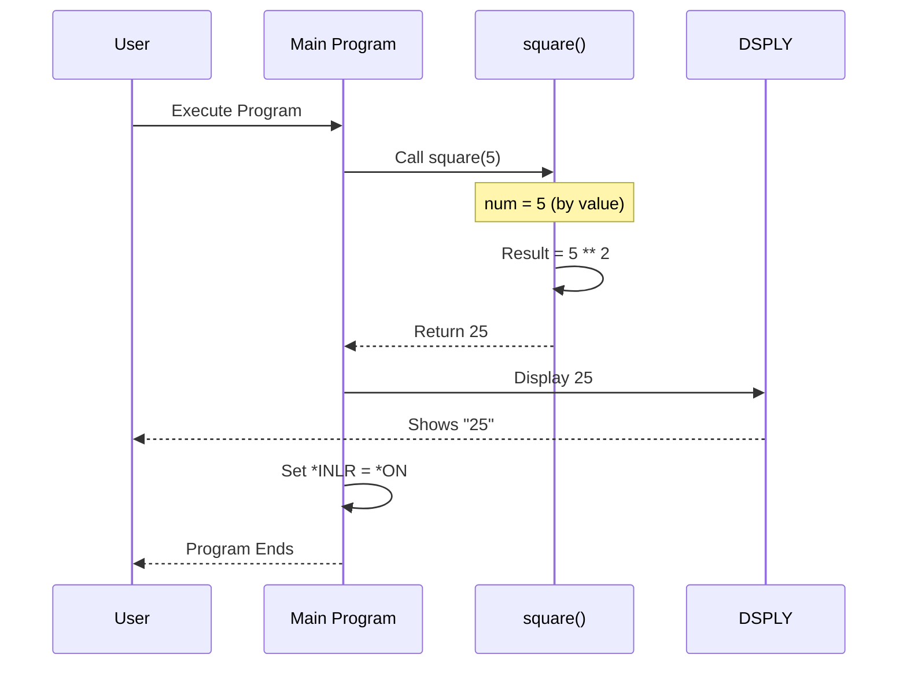

## 7. Recommendations

### Areas Requiring Closer Review

| Area | Concern | Recommendation |
|------|---------|----------------|
| Overflow Handling | No protection for large inputs | Add range validation |
| Error Handling | No error handling mechanism | Consider adding error indicators |
| Hardcoded Test Value | Value `5` is hardcoded | Consider parameterizing for testing |

### Code Quality Assessment

| Aspect | Rating | Notes |
|--------|--------|-------|
| Readability | ⭐⭐⭐⭐⭐ | Clean free-form syntax |
| Maintainability | ⭐⭐⭐⭐ | Simple, single-purpose |
| Reusability | ⭐⭐⭐ | Could be exported to service program |
| Error Handling | ⭐⭐ | No validation or error handling |

---

## 3. Date Format Handling (`date_formats.rpgle`)

A fixed-format program demonstrating IBM i date format handling and automatic conversion.

### Source Code

```rpgle
     H option(*nodebugio) datfmt(*iso)
     D* Variable definition
     D wwout           s             20a
     D wwdate          s               d   inz(*sys)
     D wwDate2         s               d   datfmt(*eur) inz(d'2020-01-01')
     C* Program start
     C     '------------'dsply
     C     wwdate        dsply
     C*                  eval      wwdate = d'1996-05-31'
     C                   eval      wwdate2 = wwdate
     C     wwdate2       dsply
     C                   eval      *inlr = *on
```

### Analysis

# RPG Program Analysis Report: date_formats.rpgle

## 1. Executive Summary

This is a simple demonstration program that illustrates IBM i date handling capabilities, specifically showing how dates can be stored in different formats (ISO and European) and how the system automatically converts between them during assignment operations. The program initializes dates using system date and literal values, then displays them to demonstrate format conversion behavior.

## 2. Program Architecture

### Overall Structure

This is a straightforward, linear program written in fixed-format RPG IV (ILE RPG). It contains no procedures or subroutines—all logic executes in the main calculation specifications (C-specs) in a sequential manner.

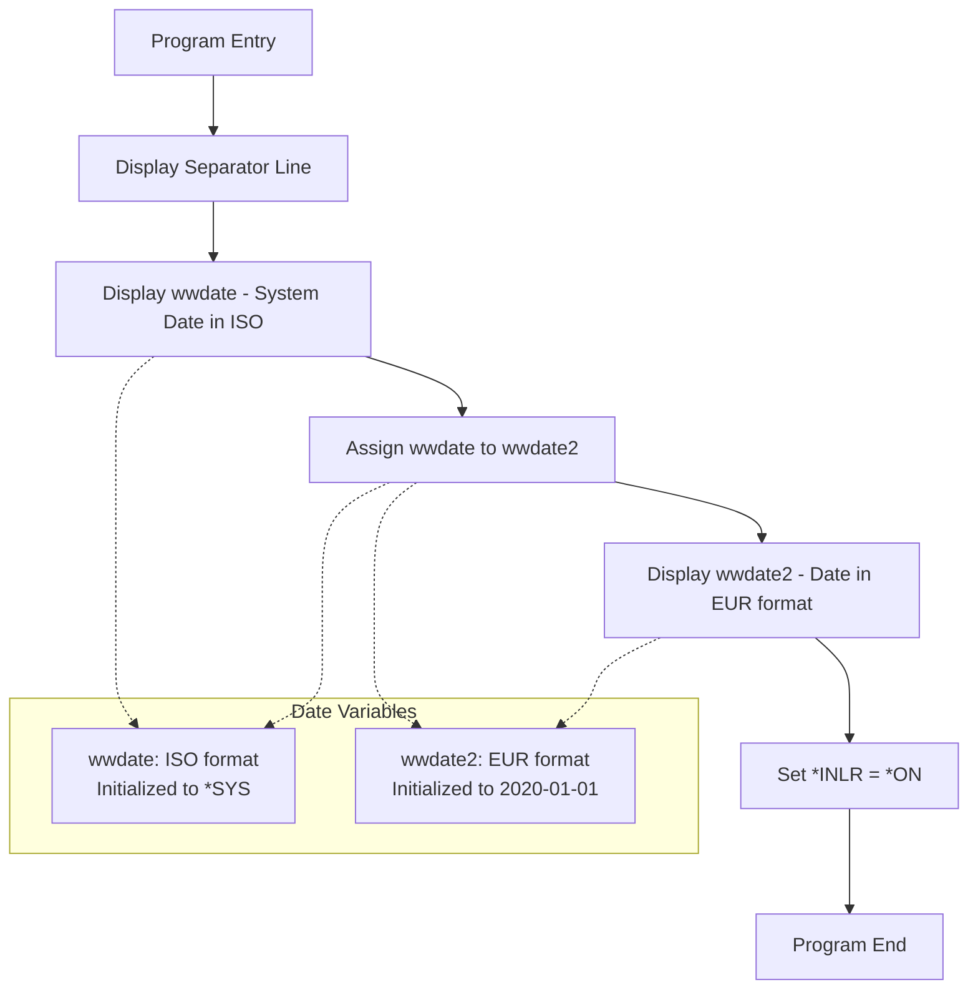

### Data Flow

1. System date is captured into `wwdate` at program initialization
2. The value flows from `wwdate` (ISO format) to `wwdate2` (EUR format)
3. Both values are displayed to the user via DSPLY operation

## 3. File Dependencies

**This program has no file dependencies.** It operates entirely with in-memory variables.

## 4. External Dependencies

**This program has no external dependencies:**
- No external program calls (EXTPGM)
- No external procedure calls (EXTPROC)
- No system API calls

The only system interaction is:
- **`*SYS` initialization**: Retrieves the current system date at program startup
- **`DSPLY` operation**: Uses the built-in display operation

## 5. Key Procedures

This program contains **no user-defined procedures**. All logic is contained in the main program body.

### Variable Definitions

| Variable | Type | Length | Format | Initialization | Purpose |
|----------|------|--------|--------|----------------|---------|
| `wwout` | Character | 20 | N/A | None | Unused output variable |
| `wwdate` | Date | N/A | ISO (*iso from H-spec) | `*SYS` (system date) | Holds current system date |
| `wwDate2` | Date | N/A | EUR | `d'2020-01-01'` | Demonstrates European date format |

## 6. Detailed Functionality Analysis

### Business Logic & Rules

This program demonstrates several important IBM i date handling concepts:

1. **Date Format Declaration**: The H-spec `datfmt(*iso)` establishes ISO (YYYY-MM-DD) as the default date format
2. **Format Override**: Individual date variables can override the default format (e.g., `wwDate2` uses `datfmt(*eur)`)
3. **Automatic Format Conversion**: When assigning dates between variables with different formats, RPG automatically converts

### Date Format Reference

| Format | Code | Display Pattern | Example |
|--------|------|-----------------|---------|
| ISO | `*ISO` | YYYY-MM-DD | 2024-01-15 |
| European | `*EUR` | DD.MM.YYYY | 15.01.2024 |

### Data Entities & Structures

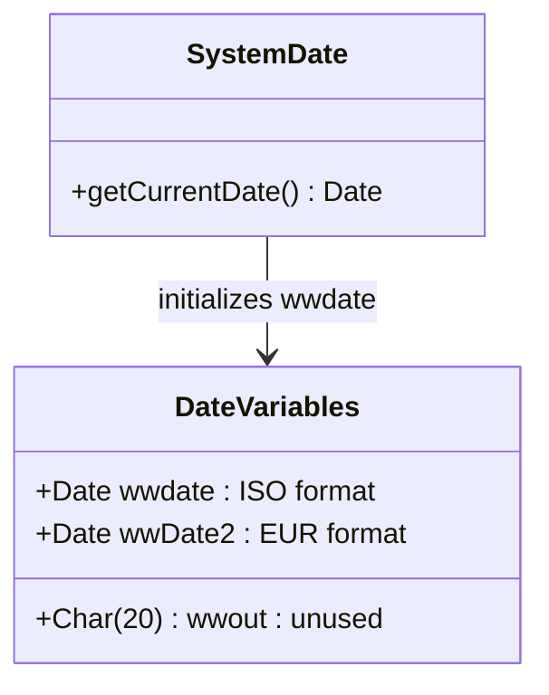

### Processing Flow

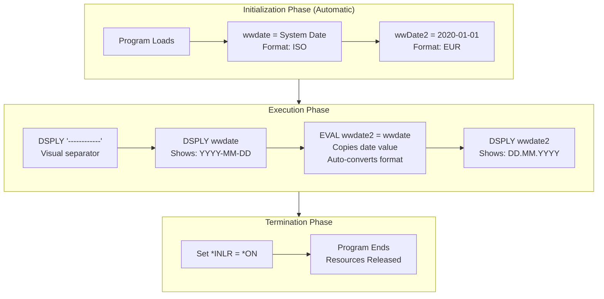

## 7. Recommendations

### Modernization Opportunities

1. **Convert to Free-Format RPG**:
   ```rpgle
   **free
   ctl-opt option(*nodebugio) datfmt(*iso);

   dcl-s wwdate date inz(*sys);
   dcl-s wwDate2 date(*eur) inz(d'2020-01-01');

   dsply '------------';
   dsply wwdate;
   wwdate2 = wwdate;
   dsply wwdate2;

   *inlr = *on;
   ```

2. **Enhanced Demonstration**: Consider expanding to show:
   - More date formats (*USA, *JIS, *MDY, *DMY, *YMD)
   - Date arithmetic (adding days, months)
   - Date duration calculations

---

## 4. Client CRUD Operations (`clients_crud.rpgle`)

A comprehensive mixed-format RPG program implementing full CRUD operations with validation.

### Source Code

```rpgle
     H option(*nodebugio) dftactgrp(*no) main(mainp)
     F*--------------- FILES --------------------------------
     Ftrclie    uf a e           k disk    usropn
     D*--------------- PROTOTYPES ---------------------------
     D* Program entry point
     Dmainp            pr                  extpgm('CLIECRUD')
     D                                1a
     D                                8s 0
     D                               30a   options(*nopass)
     D* Create procedure
     D createClient    pr
     D                                8s 0
     D                               30a
     D* Read client procedure
     D readClient      pr
     D                                8s 0
     D* Update procedure
     D updateClient    pr
     D                                8s 0
     D                               30a
     D* Delete client procedure
     D deleteClient    pr
     D                                8s 0
     D* Clear file fields procedure
     D clearFields     pr
     D*--------------- FUNCTIONS ----------------------------
     D* Validate DNI
     D dniIsValid      pr              n
     D                                8s 0
     D* DNI already exists in DB
     D dniExists       pr              n
     D                                8s 0
     D* Client is still active
     D clientActive    pr              n
     D                                8s 0
     D*--------------- GLOBALS ------------------------------
     D sysds          sds
     D currentUser           254    263
     P*------------------------------------------------------
     Pmainp            b
     D                 pi
     D paop                           1a
     D padni                          8s 0
     D paname                        30a   options(*nopass)
     D*
       open trclie;
       select;
        when paop = 'C';
         createClient(padni:paname);
        when paop = 'R';
         readClient(padni);
        when paop = 'U';
         updateClient(padni:paname);
        when paop = 'D';
         deleteClient(padni);
        other;
         dsply 'OP. Error';
       endsl;
       close trclie;
       return;
     Pmainp            e
     P*
     PcreateClient     b
     D                 pi
     D pidni                          8s 0
     D piname                        30a
       dsply 'Creating';
       if not dniIsValid(pidni);
        dsply 'DNI not valid';
        return;
       endif;
       if dniExists(pidni);
        dsply 'DNI already exists';
        return;
       endif;
       clearFields();
       cldni = pidni;
       clname = piname;
       clcrts = %timestamp();
       clcrus = currentUser;
       write retrclie;
     PcreateClient     e
     P*
     PreadClient       b
     D                 pi
     D pidni                          8s 0
     D zzmsg           s             52a
       dsply 'Reading';
       if not dniIsValid(pidni);
        dsply 'DNI not valid';
        return;
       endif;
       if not dniExists(pidni);
        dsply 'DNI not exists';
        return;
       endif;
       if not clientActive(pidni);
        dsply 'Client marked as deleted';
        return;
       endif;
       chain pidni trclie;
       if %found();
        zzmsg = %char(cldni) + '-' + clname;
        dsply zzmsg;
       endif;
     PreadClient       e
     P*
     PupdateClient     b
     D                 pi
     D pidni                          8s 0
     D piname                        30a
       dsply 'Updating';
       if not dniIsValid(pidni);
        dsply 'DNI not valid';
        return;
       endif;
       if not dniExists(pidni);
        dsply 'DNI not exists';
        return;
       endif;
       if not clientActive(pidni);
        dsply 'Client marked as deleted';
        return;
       endif;
       chain pidni trclie;
       if %found();
        clname = piname;
        clupts = %timestamp();
        clupus = currentUser;
        update retrclie;
       endif;
     PupdateClient     e
     P*
     PdeleteClient     b
     D                 pi
     D pidni                          8s 0
       dsply 'Deleting';
       if not dniIsValid(pidni);
        dsply 'DNI not valid';
        return;
       endif;
       if not dniExists(pidni);
        dsply 'DNI not exists';
        return;
       endif;
       if not clientActive(pidni);
        dsply 'Client marked as deleted';
        return;
       endif;
       chain pidni trclie;
       if %found();
        cldets = %timestamp();
        cldeus = currentUser;
        update retrclie;
       endif;
     PdeleteClient     e
     P*
     PclearFields      b
       cldni = 0;
       clname = '';
       clcrts = z'0001-01-01-00.00.00.000000';
       clcrus = '';
       clupts = z'0001-01-01-00.00.00.000000';
       clupus = '';
       cldets = z'0001-01-01-00.00.00.000000';
       cldeus = '';
     PclearFields      e
     P*
     PdniIsValid       b
     D                 pi              n
     D pidni                          8s 0
       return (pidni > 999999 and pidni < 100000000);
     PdniIsValid       e
     P*
     PdniExists        b
     D                 pi              n
     D pidni                          8s 0
       chain (pidni) trclie;
       return %found();  // *on or *off
     PdniExists        e
     P*
     PclientActive     b
     D                 pi              n
     D pidni                          8s 0
       chain pidni trclie;
       if %found();
         return cldeus = '';
       else;
         return *off;
       endif;
     PclientActive     e
     P*
```

### Analysis

# RPG Program Analysis Report: CLIECRUD (Client CRUD Operations)

## 1. Executive Summary

This RPG ILE program implements a complete CRUD (Create, Read, Update, Delete) service for managing client records in the `trclie` database file. The program follows a modular design pattern with a main entry point that routes operations to specialized subprocedures based on an operation code parameter. It includes robust validation functions for DNI (Spanish national ID) verification, existence checking, and soft-delete status validation, demonstrating good separation of concerns and defensive programming practices.

## 2. Program Architecture

### Overall Structure

The program is structured as a **linear main procedure** (`mainp`) with multiple supporting subprocedures and validation functions. It uses the ILE RPG `MAIN()` keyword to designate `mainp` as the program entry point, running in a named activation group.

### Main Procedures and Their Roles

| Procedure | Role | Type |
|-----------|------|------|
| `mainp` | Entry point, operation router | Main |
| `createClient` | Insert new client records | CRUD Operation |
| `readClient` | Retrieve and display client data | CRUD Operation |
| `updateClient` | Modify existing client records | CRUD Operation |
| `deleteClient` | Soft-delete client records | CRUD Operation |
| `clearFields` | Initialize file fields to defaults | Utility |
| `dniIsValid` | Validate DNI format/range | Validation Function |
| `dniExists` | Check if DNI exists in database | Validation Function |
| `clientActive` | Check if client is not soft-deleted | Validation Function |

### Program Flow Diagram

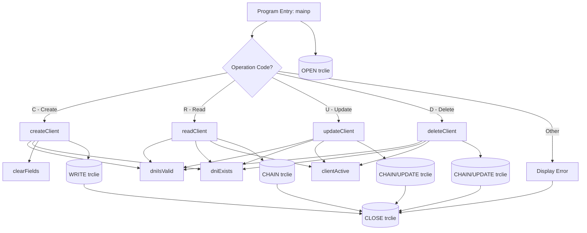

### Key Data Flows

1. **Input Parameters** → `mainp` receives operation code, DNI, and optional name
2. **Validation Chain** → All operations validate DNI before proceeding
3. **Database Operations** → CRUD procedures interact with `trclie` file
4. **Audit Trail** → Create/Update/Delete operations record timestamps and user IDs

## 3. File Dependencies

### TRCLIE (Client Master File)

| Attribute | Value | Description |
|-----------|-------|-------------|
| **File Type** | Physical Disk File | Keyed database file |
| **Usage** | Update (UF) | Full update capability |
| **Access** | Add (A) | Can add new records |
| **Format** | Externally Described (E) | Uses DDS definitions |
| **Key** | Keyed (K) | Indexed access |
| **Open** | User Controlled (USROPN) | Explicit OPEN/CLOSE |

#### Inferred File Structure

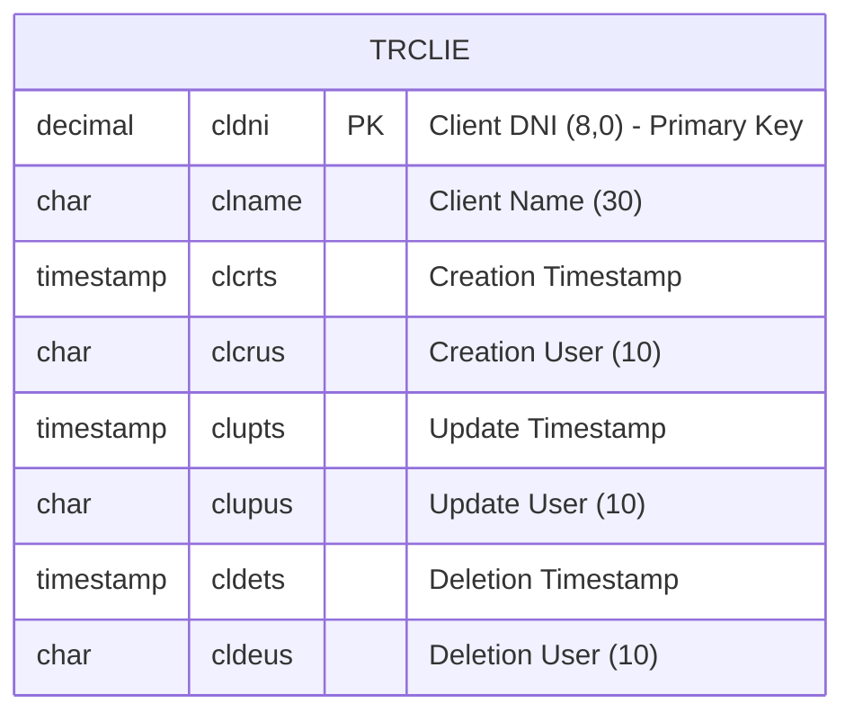

#### File Access by Procedure

| Procedure | Operations | Record Format |
|-----------|------------|---------------|
| `mainp` | OPEN, CLOSE | - |
| `createClient` | WRITE | retrclie |
| `readClient` | CHAIN | retrclie |
| `updateClient` | CHAIN, UPDATE | retrclie |
| `deleteClient` | CHAIN, UPDATE | retrclie |
| `dniExists` | CHAIN | retrclie |
| `clientActive` | CHAIN | retrclie |

## 4. External Dependencies

### External Program Reference

| Name | Declaration | Purpose |
|------|-------------|---------|
| `CLIECRUD` | `extpgm('CLIECRUD')` | Self-reference for prototype definition |

### System Resources Used

1. **Program Status Data Structure (PSDS)**
   - `sysds` - System Data Structure
   - `currentUser` (positions 254-263) - Current user profile name

2. **Built-in Functions**
   - `%timestamp()` - Current system timestamp
   - `%found()` - Record found indicator
   - `%char()` - Numeric to character conversion

## 5. Key Procedures

### mainp (Main Entry Point)

**Purpose**: Program entry point that routes operations to appropriate CRUD procedures.

**Parameters**:
| Name | Type | Length | Description |
|------|------|--------|-------------|
| `paop` | Character | 1 | Operation code (C/R/U/D) |
| `padni` | Packed Decimal | 8,0 | Client DNI number |
| `paname` | Character | 30 | Client name (optional for R/D) |

### Validation Functions

| Function | Returns | Purpose |
|----------|---------|---------|
| `dniIsValid` | Boolean | Validates DNI is 7-8 digits (999999 < DNI < 100000000) |
| `dniExists` | Boolean | Checks if DNI exists in database |
| `clientActive` | Boolean | Checks if deletion user field is blank |

## 6. Detailed Functionality Analysis

### Business Logic & Rules

#### Validation Rules

1. **DNI Format Validation**: DNI must be between 1,000,000 and 99,999,999 (7-8 digits)
   ```rpgle
   return (pidni > 999999 and pidni < 100000000);
   ```

2. **Uniqueness Constraint**: Cannot create a client with an existing DNI

3. **Soft-Delete Pattern**: Records are never physically deleted; instead, deletion is marked by populating `cldets` and `cldeus` fields

4. **Active Client Check**: A client is considered active if `cldeus` (deletion user) is blank

#### Audit Trail Requirements

Every data modification records:
- **Create**: `clcrts` (timestamp) + `clcrus` (user)
- **Update**: `clupts` (timestamp) + `clupus` (user)
- **Delete**: `cldets` (timestamp) + `cldeus` (user)

### Processing Flow

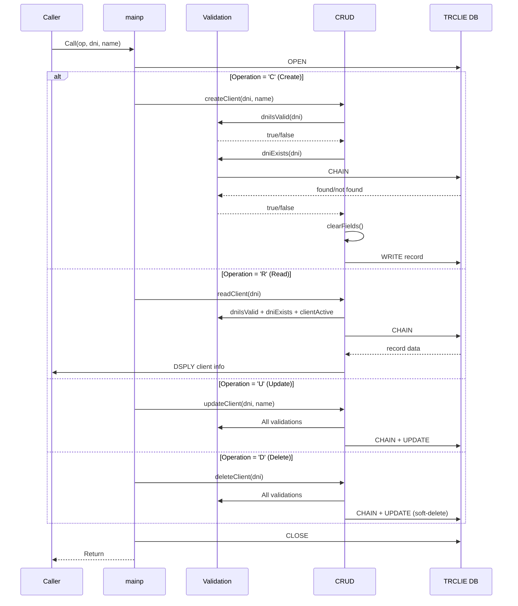

### State Transitions

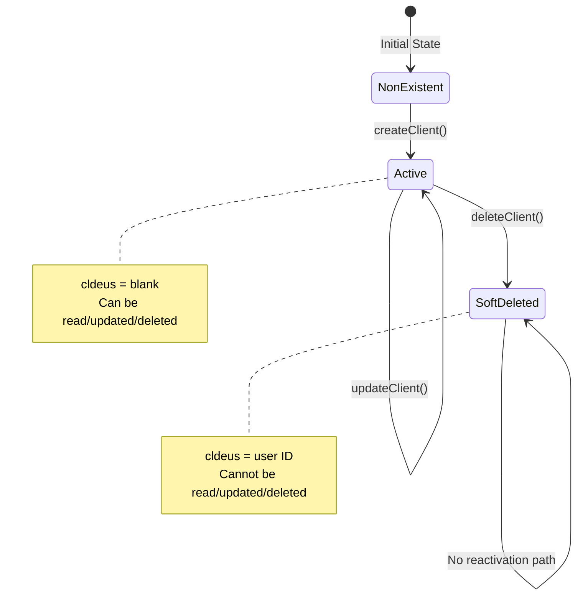

### Integration Points

#### Upstream Processes
- Any calling program that needs to manage client data
- Likely called from interactive display programs, batch jobs, or web service wrappers

#### Downstream Processes
- Other programs that read from `trclie` file
- Reporting programs that may need to filter by active status
- Archive processes that may physically remove soft-deleted records

## 7. Recommendations

### Potential Modernization Opportunities

1. **Convert to Free-Form RPG**
2. **Add Error Handling Structure** with MONITOR blocks
3. **Implement Reactivation** (operation code 'A')
4. **Add Logging** to audit log file instead of DSPLY
5. **Consider SQL Access** for better performance

### Areas Requiring Closer Review

1. **`clearFields` Procedure**: Uses hardcoded minimum timestamp
2. **DNI Validation Logic**: Could implement Spanish DNI check digit algorithm
3. **Concurrent Access**: No explicit record locking strategy
4. **Optional Parameter Handling**: No `%parms()` check for `paname`
5. **File Open/Close Pattern**: Consider keeping file open for performance

---

## Summary

| Example | Format | Key Features |
|---------|--------|--------------|
| `sum.rpgle` | Fixed-form | File I/O, subroutine, loop processing |
| `free_pow_2.rpgle` | Free-form | Subprocedure, return values, modern syntax |
| `date_formats.rpgle` | Fixed-form | Date handling, format conversion |
| `clients_crud.rpgle` | Mixed | Full CRUD, validation, soft-delete, audit trail |

All analyses were generated using the RPG Explainer tool with Mermaid diagrams for visualization of program flow, data relationships, and system interactions.
